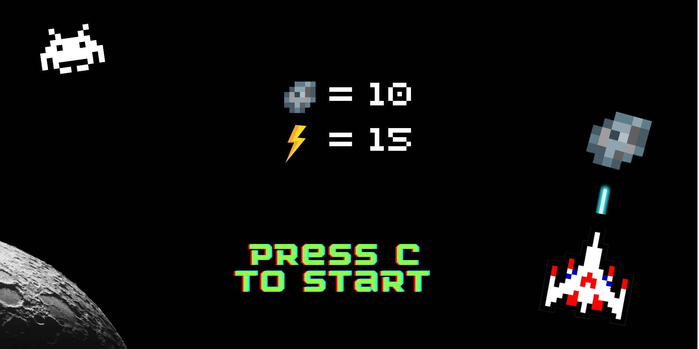

# Chuva de Meteoros (Space Invaders in Assembly)

A recreation of the classic Space Invaders game written entirely in Assembly, developed as part of the **Introduction to Computer Architecture** course at **Instituto Superior Técnico (IST)**.

The game was implemented for the **PEPE simulator**, using the **MediaCenter**, **keyboard**, and **7-segment displays** modules to handle graphics, input, and game status.

  

---

## Overview

In this game, the player controls a rover defending Planet X from waves of enemy ships (red meteors) while collecting energy from friendly ones (green meteors).  
The goal is to survive as long as possible by managing energy and avoiding collisions.

### Controls

| Key | Action |
|-----|---------|
| **C** | Start game |
| **D** | Pause / Resume |
| **E** | End game |
| **0** | Move left |
| **1** | Fire missile |
| **2** | Move right |

---

## Implementation Details

- Developed entirely in **Assembly** for the **PEPE processor**.  
- All objects (rover, missiles, meteors) are drawn pixel by pixel on the **MediaCenter display (32x64)**.  
- The program uses **cooperative routines** and **hardware interrupts** for real-time behavior:
  - Meteor movement
  - Missile movement
  - Energy decay
- Includes original assets:
  - Ship and meteor designs
  - Background music (Interstellar theme, recorded on a piano by me)
  - Custom images for all game screens

---

## Group

- João Trocado  
- Pedro Freitas  
- Tiago Firmino

---

## License

This repository is shared for educational purposes only.
